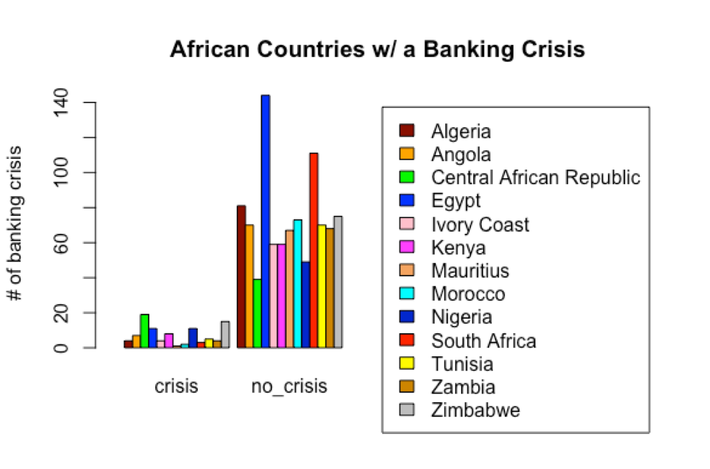
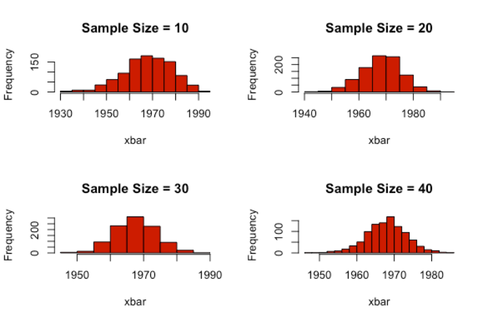

### Masters -- CS544 Final Project

This is a project that is meant for conducting analysis, and statistics, based on the African Economy.   

To find the source of the this data:  
https://www.kaggle.com/chirin/africa-economic-banking-and-systemic-crisis-data  

Please read the Documentation, which can be found in <strong><em>/doc </strong></em> for further details.  

To find the source code, look in <strong><em> /src </strong></em>  

#### Models

 Here are a couple of models from the analysis  

